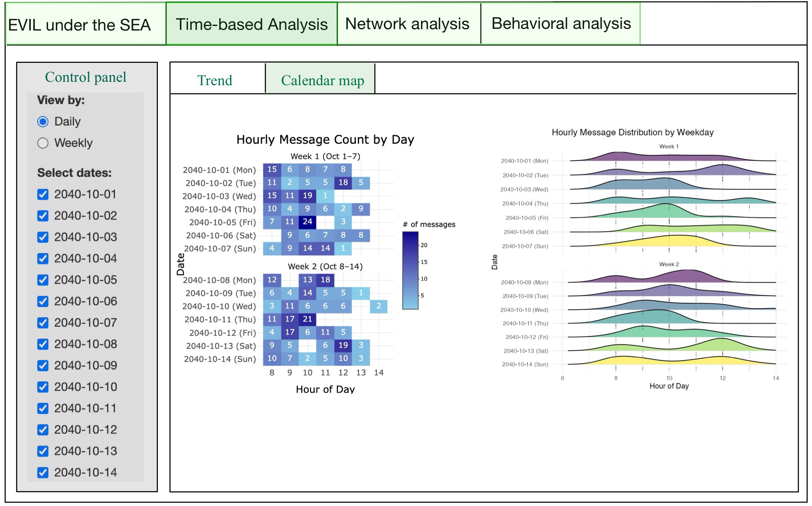
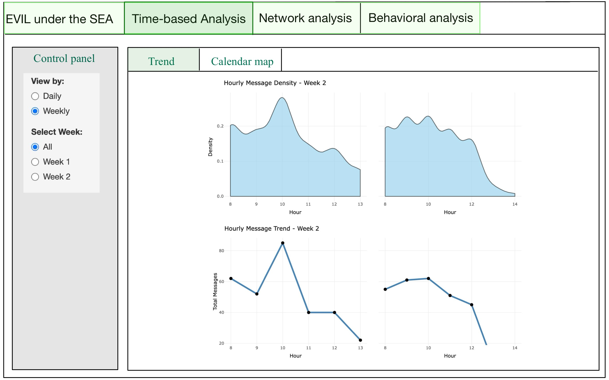
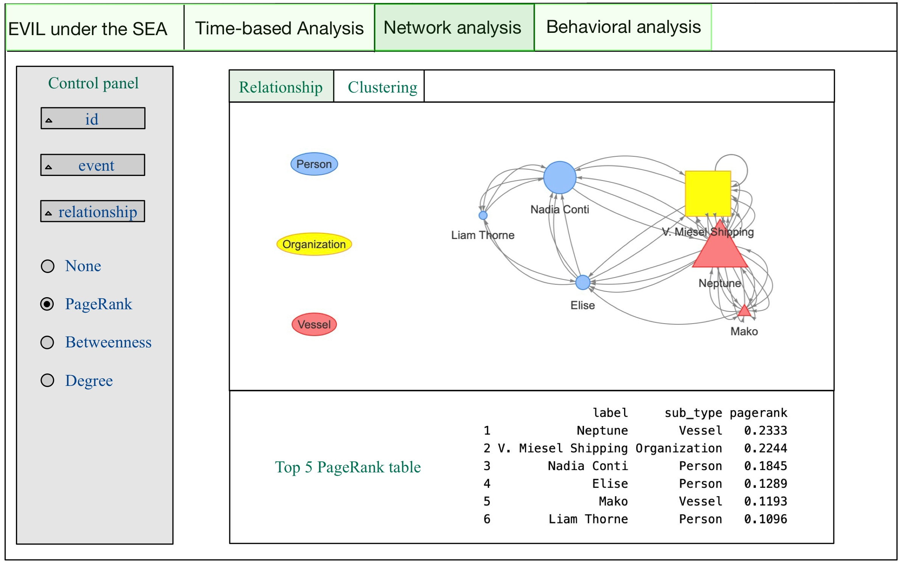
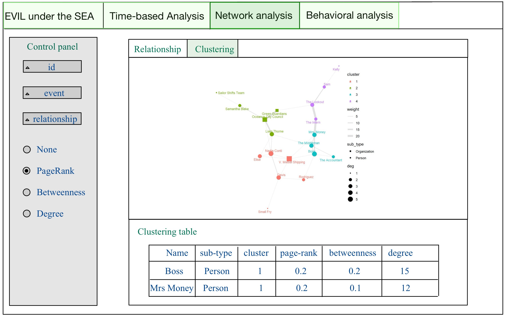
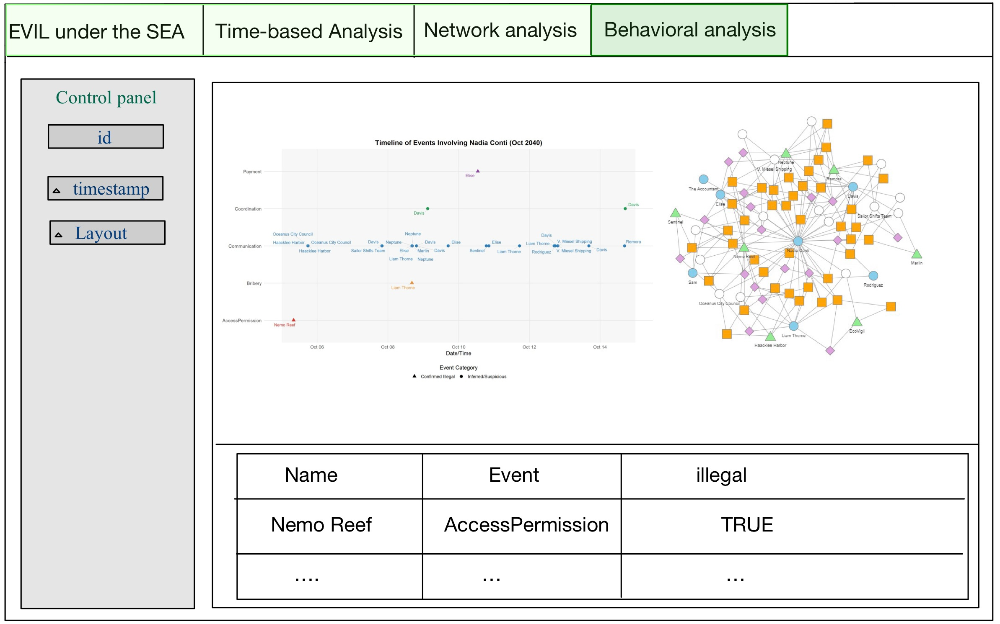

# 1 Overview

The storyboard is intended to visually depict the user experience. It serves as a tool to establish a strong visual connection between the insights derived from research and the outcomes generated through user interaction with the R Shiny data dashboard application.

This report aims to consolidate the visualization chart designs from Take-home Exercise 2, integrating the designs created by [LI YUQUAN](https://isss608-2025-yuquan.netlify.app/take-home_ex/take-home_ex02/take-home_ex02), [TAI QIUYAN](https://isss608-ay2025-qiuyan.netlify.app/takehome_ex/takehome_ex02/takehome_ex02), and [DO QUYNH TRANG](https://isss608-ay2425-qtd.netlify.app/take-home_ex/take-home_ex02/take-home_ex02) to develop a storyboard prototype in preparation for further work on the VAST Challenge 2025 Mini-Challenge 3.

My Shiny app consists of three main components:

1.  `Time-based Analysis` – Used to explore communication patterns and address Question 1.

2.  `Network Analysis` – Used to investigate the relationships between entities, addressing Questions 1.3 and 2.

3.  `Behavioral Analysis` – Used to assess the likelihood of criminal behavior by entities, addressing Question 4.

# 2 Task

## 2.1 Task For Take home exercise 3

In Take-home Exercise 3, we were required to prepare a prototype module report and design the different components of the user interface.

At the same time, we also needed to verify whether the required R packages are supported on CRAN, ensure that the necessary R code runs correctly and produces the expected output, identify the key parameters and outputs that need to be exposed in the Shiny application, and select appropriate Shiny UI components to effectively present these elements in the user interface.

## 2.2 Task For VAST Challenge 2025 Mini-Challenge 3

### 2.2.1 Background

Over the past decade, the community of Oceanus has faced numerous transformations and challenges evolving from its fishing-centric origins. Following major crackdowns on illegal fishing activities, suspects have shifted investments into more regulated sectors such as the ocean tourism industry, resulting in growing tensions. This increased tourism has recently attracted the likes of international pop star Sailor Shift, who announced plans to film a music video on the island.

Clepper Jessen, a former analyst at FishEye and now a seasoned journalist for the Hacklee Herald, has been keenly observing these rising tensions. Recently, he turned his attention towards the temporary closure of Nemo Reef. By listening to radio communications and utilizing his investigative tools, Clepper uncovered a complex web of expedited approvals and secretive logistics. These efforts revealed a story involving high-level Oceanus officials, Sailor Shift’s team, local influential families, and local conservationist group The Green Guardians, pointing towards a story of corruption and manipulation.

Your task is to develop new and novel visualizations and visual analytics approaches to help Clepper get to the bottom of this story.

### 2.2.2 Questions

Clepper diligently recorded all intercepted radio communications over the last two weeks. With the help of his intern, they have analyzed their content to identify important events and relationships between key players. The result is a knowledge graph describing the last two weeks on Oceanus. Clepper and his intern have spent a large amount of time generating this knowledge graph, and they would now like some assistance using it to answer the following questions.

1.  Clepper found that messages frequently came in at around the same time each day.

    1.  Develop a graph-based visual analytics approach to identify any daily temporal patterns in communications.

    2.  How do these patterns shift over the two weeks of observations?

    3.  Focus on a specific entity and use this information to determine who has influence over them.

2.  Clepper has noticed that people often communicate with (or about) the same people or vessels, and that grouping them together may help with the investigation.

    1.  Use visual analytics to help Clepper understand and explore the interactions and relationships between vessels and people in the knowledge graph.

    2.  Are there groups that are more closely associated? If so, what are the topic areas that are predominant for each group?

        -   For example, these groupings could be related to: Environmentalism (known associates of Green Guardians), Sailor Shift, and fishing/leisure vessels.

3.  It was noted by Clepper’s intern that some people and vessels are using pseudonyms to communicate.

    1.  Expanding upon your prior visual analytics, determine who is using pseudonyms to communicate, and what these pseudonyms are.

        -   Some that Clepper has already identified include: “Boss”, and “The Lookout”, but there appear to be many more.

        -   To complicate the matter, pseudonyms may be used by multiple people or vessels.

    2.  Describe how your visualizations make it easier for Clepper to identify common entities in the knowledge graph.

    3.  How does your understanding of activities change given your understanding of pseudonyms?

4.  Clepper suspects that Nadia Conti, who was formerly entangled in an illegal fishing scheme, may have continued illicit activity within Oceanus.

    1.  Through visual analytics, provide evidence that Nadia is, or is not, doing something illegal.

    2.  Summarize Nadia’s actions visually. Are Clepper’s suspicions justified?

# 3 storyboard prototype

## 3.1 Time-based Analysis

This section is designed to identify communication patterns and trends over a period of time. It features two views, Trend and Calendar Map, which can be toggled to explore overall communication density, daily message volumes, weekly communication trends, and hourly communication patterns across days. A control panel on the left allows users to switch between Daily and Weekly modes. In Daily mode, users can freely select one or multiple dates to examine specific trends, while in Weekly mode, users can choose between All, Week 1, and Week 2. The All option automatically arranges the visualizations into side-by-side comparisons of the two weeks, providing a clear and intuitive understanding of how communication patterns differ between them.

::: panel-tabset
### Layout





### Description

| Component | Type | Belongs To | Description |
|----------------|----------------|----------------|-------------------------|
| View Mode Selector | Radio Button | Global Control | Allows users to switch between Daily and Weekly views for time-based communication analysis. |
| Sub-View Selector | Radio Button | Global Control | Allows users to switch between Trend View and Calendar Map View for different visualization layouts. |
| Select Dates | Checkbox Group | Daily View | In Daily mode, users can select one or multiple specific dates (Oct 1–14) to explore daily patterns. |
| Select Week | Radio Button | Weekly View | In Weekly mode, users can choose to display All, Week 1, or Week 2 to compare weekly patterns. |
| Hourly Heatmap | Heatmap Plot | Calendar Map View | Displays hourly message counts per day using a calendar-like grid for visualizing temporal intensity. |
| Ridgeline Plot | Density Plot | Calendar Map View | Shows distribution of message activity by hour across days using ridgeline plots, highlighting daily rhythm. |
| Hourly Density Plot | Area Chart | Trend View | Shows smoothed distribution of message volume across hours within a selected week (e.g., Week 2). |
| Total Message Trend | Line Chart | Trend View | Plots total message count per hour to reveal hourly activity trends and peaks over selected time frame. |
| Weekly Message Trend | Line Chart | Trend View | Displays weekly aggregated message counts using a line chart for weekly comparisons. |
:::

## 3.2 Network Analysis

This section focuses on network analysis, aiming to explore the associations, communication patterns, and specific relationships among different entities. It is divided into two main views: *Relationship* and *Clustering*. The Relationship view provides a direct visual representation of interactions and connections between entities, while the Clustering view reveals different communication clusters, offering a more intuitive understanding of communication patterns and relationships. The control panel on the left allows users to filter by a specific ID to focus on, and also to narrow down the analysis by selecting specific events or relationship types. If no filters are applied to events or relationships, nodes will be connected directly based on their links. Below the control panel, users can choose from PageRank, Betweenness, or Degree metrics to evaluate node relevance, which will affect the display of the metrics table below.

::: panel-tabset
### Layout





### Description

| Component | Type | Belongs To | Description |
|---------------|---------------|---------------|---------------------------|
| ID Filter | Dropdown/Select | Control Panel | Filters network view to highlight a specific entity based on selected ID. |
| Event Filter | Dropdown/Select | Control Panel | Limits the network to only include edges related to selected event types. |
| Relationship Filter | Dropdown/Select | Control Panel | Filters edges by relationship type; if none selected, all relationships are shown. |
| Centrality Selector | Radio Button | Control Panel | Allows user to choose centrality metric: None, PageRank, Betweenness, or Degree. |
| Sub-View Selector | Tab Switch | Network Analysis Module | Allows users to switch between Relationship View and Clustering View for exploring networks. |
| Relationship Graph | Network Plot | Relationship View | Visualizes direct links between entities; node shape and size represent type and relevance. |
| PageRank Table | Data Table | Relationship View | Displays top 5 entities ranked by PageRank, including type and PageRank score. |
| Cluster Graph | Network Plot | Clustering View | Displays entity clusters with edge weights and colored clusters. Node size shows degree. |
| Clustering Table | Data Table | Clustering View | Presents nodes’ cluster, sub-type, and centrality scores (PageRank, Betweenness, Degree). |
:::

## 3.3 Behavioral Analysis

This section focuses on analyzing the behavioral patterns of entities. Users can select the specific entity name to focus on, along with the time range and the desired network graph layout. The output consists of three main parts: a timeline-based chart that helps infer direct criminal activities, a network graph with interactive edges labeled as *True* or *False* to indicate suspected involvement in crimes, and a summary table at the bottom of the interface listing related entity names and their associated criminal status.

::: panel-tabset
### Layout



### Description

| **Component** | **Type** | **Belongs To** | **Description** |
|--------------|--------------|--------------|--------------------------------|
| Entity Selector | Dropdown/Select | Control Panel | Filters view by selected entity name to focus behavioral analysis. |
| Timestamp Filter | Date Range Picker | Control Panel | Allows users to define time window for observed behaviors. |
| Layout Selector | Dropdown/Select | Control Panel | Allows users to change the layout of the behavioral network graph. |
| Timeline Chart | Scatter Plot | Behavioral View | Displays events involving the selected entity over time, separated by category. |
| Behavioral Network Graph | Network Plot | Behavioral View | Visualizes entity interactions; edge color/label reflects illegal or suspicious behavior (TRUE/FALSE). |
| Criminal Involvement Table | Data Table | Behavioral View | Lists entities, event types, and whether each is confirmed or suspected to be involved in illegal activity. |
:::

# 4 Code

## 4.1 R packages

::: panel-tabset
### Packages

| Library | Purpose |
|----------------------|--------------------------------------------------|
| `shiny` | Core R package for building interactive web applications directly from R. |
| `shinydashboard` | Extension of Shiny that simplifies the creation of dashboard layouts with sidebar, header, and boxes. |
| `shinycssloaders` | Adds loading spinners to Shiny outputs while they're being calculated, improving user experience. |
| `ggplot2` | Part of tidyverse; grammar of graphics system for building complex static visualizations like bar charts, scatterplots, and boxplots. |
| `plotly` | Enables interactive, zoomable, and web-friendly versions of ggplot2 charts or standalone plots. |
| `ggridges` | Adds ridge/density plots to ggplot2, useful for visualizing distributions across multiple groups. |
| `ggraph` | Extends ggplot2 for network/graph visualizations with custom layouts like force, circle, dendrogram. |
| `ggiraph` | Creates interactive ggplot-based plots with tooltips, hover actions, and JavaScript-enhanced interactivity. |
| `jsonlite` | Parses and generates JSON, allowing data exchange between R and web APIs or files. |
| `tibble` | A modern reimagining of data frames that is simpler and more readable; core to tidyverse. |
| `dplyr` | Enables fast and intuitive data manipulation: filter, select, group_by, mutate, summarize, joins. |
| `tidyverse` | A meta-package including ggplot2, dplyr, tidyr, readr, purrr, tibble, stringr, and forcats. |
| `lubridate` | Simplifies working with date and time data (parsing, extraction, arithmetic). |
| `patchwork` | Combines multiple ggplot2 plots into one cohesive layout without manually adjusting alignment. |
| `igraph` | Provides comprehensive tools for creating, analyzing, and plotting graphs and networks. |
| `tidygraph` | Bridges igraph and tidyverse, allowing tidy manipulation of network/graph structures. |
| `visNetwork` | Enables interactive and zoomable graph/network visualization using vis.js for Shiny/web. |
| `DT` | Provides interactive HTML tables in Shiny with sorting, filtering, and paging capabilities. |
| `SmartEDA` | Automates Exploratory Data Analysis (EDA) including summary statistics and basic plots. |

### The Code

```{r}
pacman::p_load(shiny, shinydashboard, 
                              shinycssloaders,ggplot2, 
                              plotly, ggridges,
                              ggraph, ggiraph,
                              jsonlite, tibble, 
                              dplyr, tidyverse, 
                              lubridate, patchwork,
                              igraph, tidygraph, 
                              visNetwork,DT, SmartEDA)
      
```
:::

## 4.2 UI Code

```{r}
ui <- navbarPage(
  title = "EVIL under the SEA",
  
  # Time-based Analysis Tab 
  tabPanel("Time-based Analysis",
           fluidPage(fluidRow(radioButtons("view_mode",
                            "View by:", 
                            choices = c("Daily", 
                                        "Weekly")),
               conditionalPanel(
                 condition = "input.view_mode == 'Daily'",
                 checkboxGroupInput("selected_dates",
                                    "Select dates:", 
                                    choices = NULL)),
               conditionalPanel(
                 condition = "input.view_mode == 'Weekly'",
                 radioButtons("selected_week", 
                              "Select Week:", 
                              choices = c("All",
                                          "Week 1", 
                                          "Week 2")))),
             fluidRow(
               tabsetPanel(
                 tabPanel("Trend",
                          column(width = 12, 
                                 plotlyOutput("ap3")),
                          column(width = 12,
                                 plotlyOutput("ap4")),
                          column(width = 12,
                                 plotlyOutput("bp2"))),
                 tabPanel("Calendar map",
                          column(width = 6, 
                                 plotlyOutput("bp1")),
                          column(width = 6,
                                 plotOutput("bp3"))))))),
  
  # Network Analysis Tab 
  tabPanel("Network Analysis",
           fluidPage(
             tabsetPanel(
               tabPanel("Relationship",
                        fluidRow(
                          column(width = 3,
                                 selectInput("rel_id", 
                                             "Select ID", 
                                             choices = NULL),
                                 selectInput("rel_event", 
                                             "Select Event", 
                                             choices = NULL),
                                 selectInput("rel_type", 
                                             "Select Relationship", 
                                             choices = NULL),
                                 radioButtons("rel_metric", 
                                              "Highlight by:",
                                              choices = c("Page Rank", 
                                                          "Event", 
                                                          "Relationship", 
                                                          "None"))),
                          column(width = 9,
                                 plotOutput("network_plot"),
                                 DT::dataTableOutput("pagerank_table")))),
               tabPanel("Clustering",
                        fluidRow(column(width = 3,
                                 selectInput("clus_id", 
                                             "Select ID",
                                             choices = NULL),
                                 selectInput("clus_event", 
                                             "Select Event",
                                             choices = NULL),
                                 selectInput("clus_rel",
                                             "Select Relationship", 
                                             choices = NULL),
                                 radioButtons("clus_metric", 
                                              "Highlight by:",
                                              choices = c("Page Rank", 
                                                          "Event", 
                                                          "Relationship", 
                                                          "None"))),
                          column(width = 9,
                                 plotOutput("cluster_network"),
                                 DT::dataTableOutput("cluster_table"))))))),
  
  # Behavioral Analysis Tab
  tabPanel("Behavioral Analysis",
           fluidPage(
             fluidRow(
               column(width = 3,
                      selectInput("behav_id", 
                                  "Select ID", 
                                  choices = NULL),
                      selectInput("behav_time", 
                                  "Select Timestamp",
                                  choices = NULL),
                      selectInput("behav_layout",
                                  "Select Layout", 
                                  choices = c("Grid", 
                                              "Timeline"))),
               column(width = 9,
                      plotlyOutput("behavior_plot1"),
                      plotlyOutput("behavior_plot2"),
                      DT::dataTableOutput("behavior_table"))))))
```

## 4.3 Server Code

```{r}
server <- function(input, output, session) {
  output$ap3 <- renderPlotly({})
  output$ap4 <- renderPlotly({})
  output$bp2 <- renderPlotly({})
  output$bp1 <- renderPlotly({})
  output$bp3 <- renderPlot({})
  output$network_plot <- renderPlot({})
  output$pagerank_table <- DT::renderDataTable({})
  output$cluster_network <- renderPlot({})
  output$cluster_table <- DT::renderDataTable({})
  output$behavior_plot1 <- renderPlotly({})
  output$behavior_plot2 <- renderPlotly({})
  output$behavior_table <- DT::renderDataTable({})
}
```

# 5 Reference

-   [R Shiny](https://shiny.posit.co)
-   [ISSS608 Visual Analytics and Applications](https://isss608-ay2024-25apr.netlify.app)
